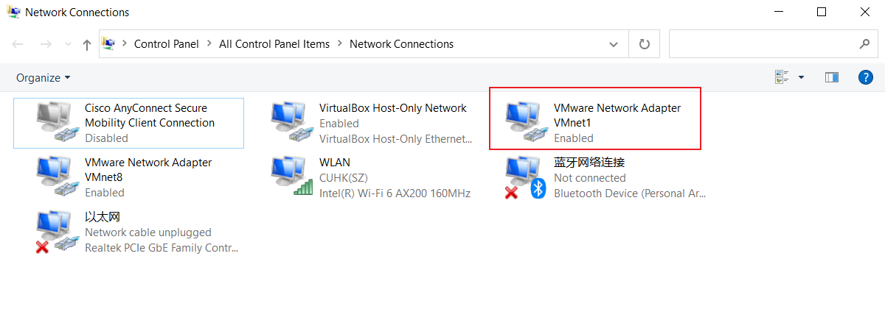

## 0. 我使用的环境

目标：在电脑上运行Linux虚拟机，并在Windows下编辑、编译该虚拟机中的文件

* **Ubuntu 16.04**虚拟机（安装于**VMware** Workstation 16 Player）
* Xshell
* VScode (Remote - SSH 插件)


## 1. 虚拟机安装并启动SSH服务

### 1.1 安装SSH

```
sudo apt-get install openssh-server
```

我在执行安装命令的时候遇到如下报错：

```
...
The following packages have unmet dependencies:
openssh-server : Depends: openssh-client (= 1:7.2p2-4)
Depends: openssh-sftp-server but it is not going to be installed
...
```

可以先安装指定版本的openssh-client:

```
sudo apt-get install openssh-client=1:7.2p2-4
```

然后在此执行安装命令 `sudo apt-get install openssh-server`

([Reference Link](https://www.cnblogs.com/liuyanerfly/p/10299943.html))

### 1.2 启动SSH服务并确认

```
sudo /etc/init.d/ssh start    #启动命令
ps -e | grep ssh              #确认ssh服务启动
```

此后，每次开机，ssh都会自动启动


## 2. 更改虚拟机网络适配器设置

VMware Workstation 16 Player 中设置“网络适配器”的位置在，

* 如果虚拟机已打开：导航栏 "Player(P)" > 可移动设备 > 网络适配器 > 设置
* 如果虚拟机未打开：直接选择“编辑虚拟机设置” > 网络适配器

在“网络连接”中，选择“桥接模式(B): 直接连接物理网络”并勾选“复制物理网络连接状态(P)”

（默认是“NAT模式”）

### 2.1 桥接模式连不上网?

（在“桥接模式”下）再次启动虚拟机，如果你发现连不上网，那么你遇到了跟我一样的问题。

这里我提供一个[其他人的解决方案链接](https://blog.csdn.net/chan0311/article/details/79589401)，但因为这个方法太麻烦了，我没有尝试。

下面我会详细讲我的解决方法：

* 点击Windows右下角网络小图标

* 选择"Network & Internet settings"

  

* 在"Advanced network settings"中，点击"Change adapter options"

  

  我看到了"VMware Network Adapter VMnet1: Enabled"，

  所以我测试在虚拟机“网络适配器设置”中，选择“自定义(U): 特定虚拟网络”，并在下拉菜单中选择“VMnet1 (仅限主机模式)”，再次打开虚拟机似乎一切正常，也可以继续接下来的步骤。

  （我并不知道为什么可以这么设置）


## 3. 获取虚拟机IP

两种获取IP方法，任选一种

### 3.1 GUI获取IP

设置 > Network > IPv4 Address

### 3.2 命令行获取IP

```
ifconfig -a
```


## 4. 用SSH客户端登陆

这里以Xshell为例

新建一个连接，在弹出的设置窗口"General"中：

* Name - 随便取
* Host - 粘贴上一步获取到的IPv4 Address
* 输入你虚拟机的用户名、密码

至此，你已经可以在Xshell中操控你的虚拟机了。以后，只要启动了虚拟机，你都可以通过Xshell远程操控它。

(Step 1-4, ref: https://www.cnblogs.com/yinliang-liang/p/9842716.html)


## 5. VScode (Remote - SSH 插件)

https://zhuanlan.zhihu.com/p/68577071

