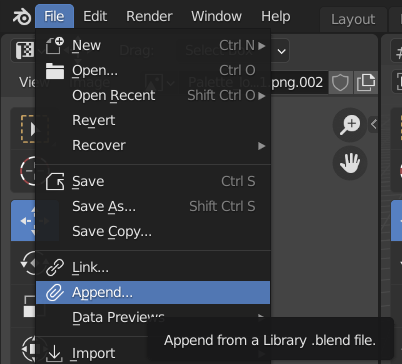

## 使用material library的原因

多人合作时，方便颜色统一（尤其针对统一玻璃之类的复杂材质）

## 如何导入material

1. 打开想要导入material的 blender file
2. 导航栏选择 File > Append
3. 找到`material_template_lib.blend`，并双击进入
4. 进入`Material`文件夹，并双击选择想导入的material

这样在Material selector中应该就能找到刚刚导入的material

（注意**重命名**导入的material）

（ref https://blender.stackexchange.com/questions/63018/how-to-import-downloaded-materials-files/63055）

## *合作方式

比如我负责选定玻璃的材质，那么我就

* 下载最新的`material_template_lib.blend`
* 新建一个cube，后新建并附上调好的玻璃材质
* commit回GitHub，更新`material_template_lib.blend`
