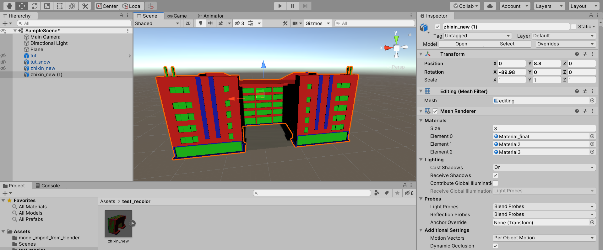

**The palette style UV coloring method** 是一个使用**调色板图片(palette)** 对模型涂色的方法

* 优点：涂色非常简单快速，可以边建模边涂色（辅助建模）
* 缺点：有的时候不好找想要的颜色；多人合作时不方便后期统一颜色；导入unity时需要更改几个默认设置

为解决这些问题，我找到了一个快速对 UV coloring 的模型**用标准 material 重新上色**的方法。总的效率可能比建完整个模型再上色更高。

## The palette style UV coloring method

这个方法来自于一名油管大佬 [https://www.youtube.com/watch?v=1jHUY3qoBu8](https://www.youtube.com/watch?v=1jHUY3qoBu8)

他在这个视频的 02:12 - 4:42 介绍了这个涂色方法

这个视频的简介里，他给了两个 palette 的图片：

* [图一](https://www.youtube.com/redirect?v=1jHUY3qoBu8&event=video_description&redir_token=QUFFLUhqblZ6eF9xZ094cFJEaUJXX1VvbHgzVllTdTI5Z3xBQ3Jtc0tseU9hX1phWUtTUl90cWNNREs5elpITkZSUE96RGhwUTNKNFFmZlJSRThIX1JjZHl2eVhrMm05Z1BNcDl0LTl0WW5vUWFvVXdlQzNqb1VuVWRYeUNLSGJ4blI2Rlp4U0FyQlFTWDdSWTlVWkZFZnBVYw%3D%3D&q=https%3A%2F%2Fwww.dropbox.com%2Fs%2Fc5olic38j8fopet%2FImphenziaPalette01.png%3Fdl%3D0)

* [图二](https://www.youtube.com/redirect?v=1jHUY3qoBu8&event=video_description&redir_token=QUFFLUhqbmtxSGEza1hSYmp6OEk2VTZvOFRtTjR0bWNjd3xBQ3Jtc0tubXVMSGsybFBKR2NwWklHNHRVM1BBM0ZaZXFpS0dEU3k5VU5aR3RVbmY1WXpQbnBPLVdqeEpQWFI4ejVjOVpjcUtFbHJjWnktMk5ma2o2d3hKSU1SVHNtbnd5Q2pTLUxNd3pCRUhxWjF0SDktQkc3Yw%3D%3D&q=https%3A%2F%2Fwww.dropbox.com%2Fs%2F1w98xiksiwaywqx%2FImphenziaPalette01-256-Gradient.png%3Fdl%3D0)

以及一个我觉得蛮不错的blender setting视频（这个很短的视频里也介绍了 The palette style UV coloring method 的方法）：

[https://www.youtube.com/watch?v=BlxiCd0Upg4](https://www.youtube.com/watch?v=BlxiCd0Upg4)

## 用标准 material 重新上色

假设在建模的时候，我把墙面涂成了诡异的蓝色，而右边material栏中的 `Material_final` 是最终统一的墙面颜色。

1. `tab` 进入编辑模式

2. 鼠标放在中间的编辑窗口，按 `A` 全选

3. 点亮左侧 UV editor 窗口的这个icon (红色框框)

   

4. 左键框选诡异的蓝色，这样中间窗口中所有使用这种蓝色的面就被选中了

   

5. 这时候在右侧material栏更换material，并点击`Assign`，墙面就重新上色完成

   

同理，我们也可以对其他面重新上色

这样直接把`.blend` 文件拖入unity 也可以保持所有颜色，无需任何设置。

